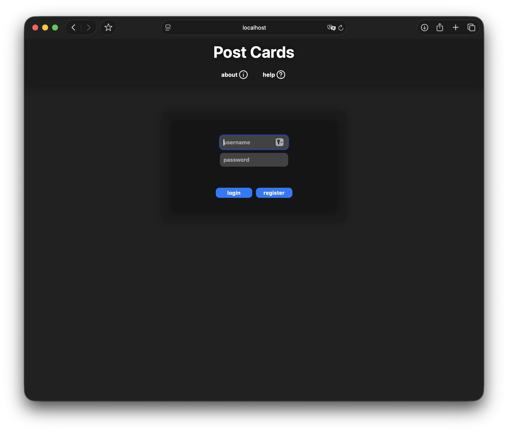
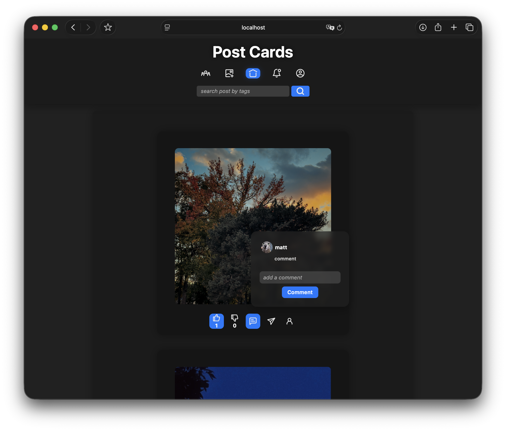
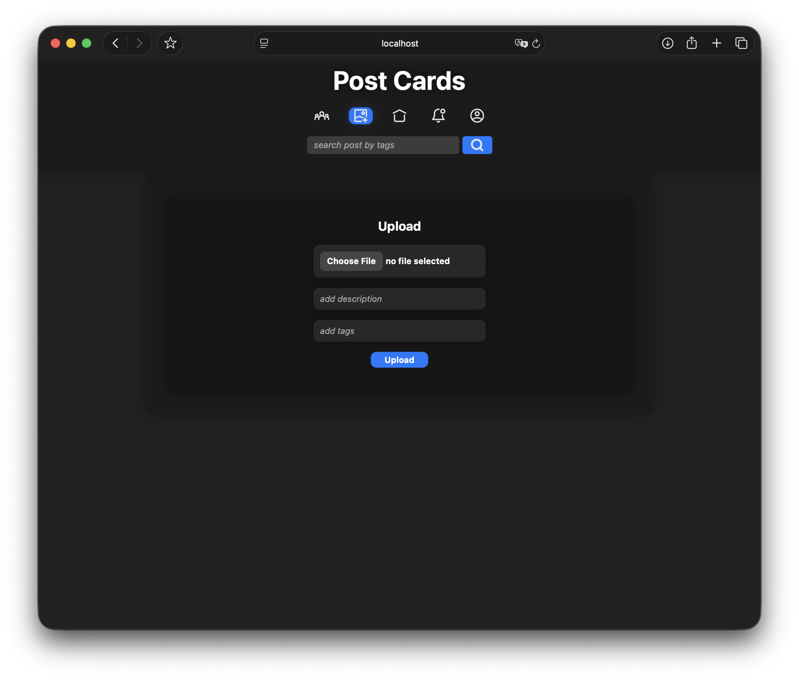
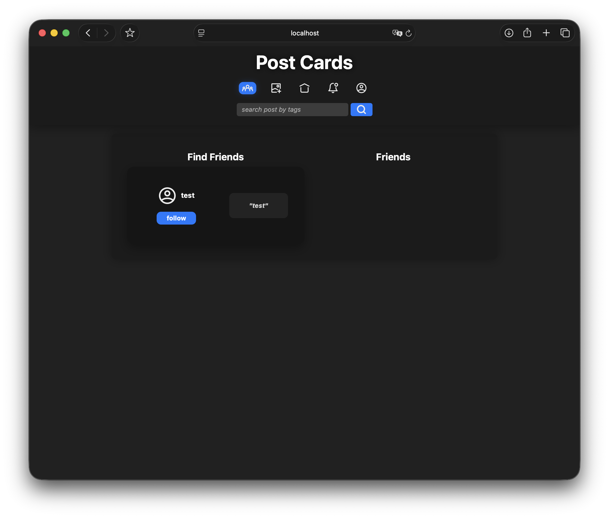
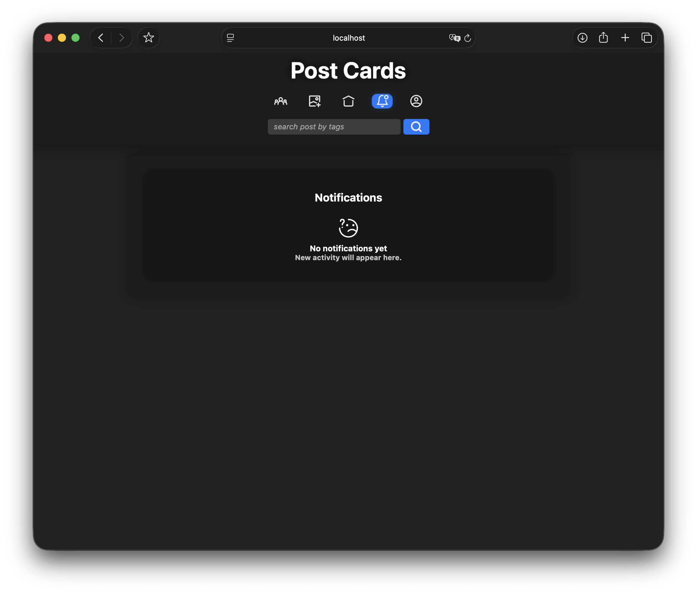
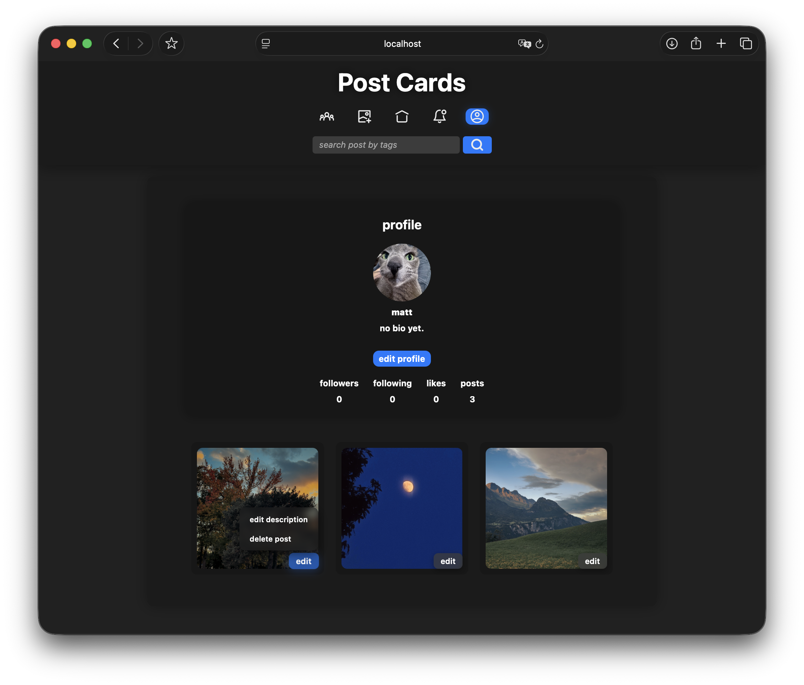
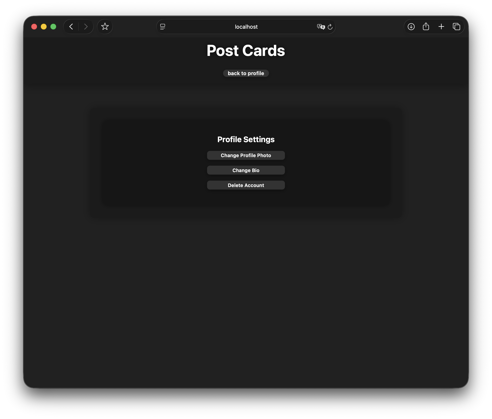

# Web-Dev-Project
A social-media style web application built with PHP, JavaScript, CSS, PostgreSQL, and Docker.

## Features
- **User accounts**
  - user registration and login
  - password hashing on registration
  - password verification on login

- **Database-backed content**
  - stores users, profiles, posts, comments, reactions
  - loads posts, comments, reactions, profile data, and users from PostgreSQL

- **Post system**
  - image upload with optional descriptions
  - home feed displaying posts from the database
  - like and dislike reactions that persist after refresh
  - comment form and saved comments for each post

- **Profile system**
  - profile page with user photo, username, bio, stats, and user posts
  - edit post descriptions
  - delete posts created by the logged-in user

- **Settings**
  - update profile photo
  - update bio
  - delete account

- **App views**
  - tab navigation for home, upload, friends, notifications, and profile
  - find-friends and friends sections
  - notifications empty state

## Screenshots

### Login


### Home Feed


### Upload Post


### Users


### Notifications


### Profile


### Edit Profile



## How to Run Locally
This project uses Docker for PostgreSQL and PHP's built-in local server for the web app.

### 1. Start PostgreSQL
Run this from the project root:
```bash
docker compose up -d
```

### 2. Create the database, if needed
The app connects to a PostgreSQL database named `social_media`.

If this is your first time running the project, create that database:
```bash
docker compose exec db createdb -U postgres social_media
```

If you see an error saying the database already exists, you can ignore it.

### 3. Create the tables, if needed
Load the included schema into the `social_media` database:
```bash
docker compose exec -T db psql -U postgres -d social_media < table.sql
```

If the tables already exist, you do not need to run this again.

### 4. Start the PHP server
Run this from the project root:
```bash
php -d upload_max_filesize=20M -d post_max_size=25M -S localhost:8000
```

Important: serve the project root, not only the `public` folder. The PHP forms submit to files inside the `app` folder.

### 5. Open the app
Visit the login page:
```text
http://localhost:8000/public/HTML/login.php
```

Create an account from the register page, then log in.


## Running with XAMPP
(This is an alternative method if the PHP development server is not available.)

### 1. If using XAMPP, place the project folder inside:
```bash
C:\xampp\htdocs\
```
### 2. Start Apache from the XAMPP Control Panel

### 3. Make sure Docker is running for PostgreSQL
```bash
docker compose up -d
```

### 4. Visit
```text
http://localhost/social-media-app/public/HTML/login.php
```

## Credits

Icons from [Iconoir](https://iconoir.com).
